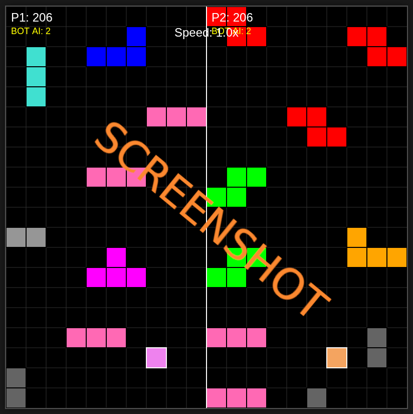

# js_tetrominoracing

## Play it now: https://pemmyz.github.io/js_tetrominoracing/

# Tetromino Path Racer - 2 Player

🎮 A fast-paced 2-player browser game where you race vertically while avoiding falling tetrominos! Features bot AI, keyboard controls, and four AI strategies per player.

## 📸 Screenshots

### Game
  

## 🕹️ Gameplay Overview

Each player controls a block that must avoid falling tetrominos. Survive as long as you can to score points. Enable a bot to play automatically and experiment with different AI strategies.

- **Player 1 (Left Side)**:
  - Movement: `←` / `→`
  - Toggle Bot: `B`
  - Change AI: `1`–`4`
  
- **Player 2 (Right Side)**:
  - Movement: `A` / `D`
  - Toggle Bot: `N`
  - Change AI: `7`–`0` (`7→1`, ..., `0→4`)

- **Global Controls**:
  - Adjust Speed: `↑` / `↓`
  - Pause: `P`
  - Restart: Any key after game over

## 🤖 AI Modes

Each bot can choose from 4 different pathfinding strategies:

| AI Mode | Name             | Description                                                                 |
|---------|------------------|-----------------------------------------------------------------------------|
| 1       | BFS              | Finds the nearest safe column using Breadth-First Search.                   |
| 2       | Greedy           | Chooses the neighbor with the least immediate danger.                       |
| 3       | Center-Hugger    | Picks safer routes favoring the middle lanes while avoiding risk.           |
| 4       | Opportunist      | Targets the widest visible safe gap and navigates toward it.               |

## 🧠 Features

- 💥 Dynamic tetromino spawning in lanes
- 🧠 Toggleable AI bots per player with 4 algorithms
- ⏱️ Adjustable game speed from 0.2x to 5.0x
- 🎨 Clean canvas rendering per player
- 🛑 Pausing and restart mechanics
- 🧱 Lane-based spawning with collision buffer zone

## 🛠️ Tech Stack

- HTML5 + CSS3
- JavaScript (Vanilla)
- Canvas API for rendering

